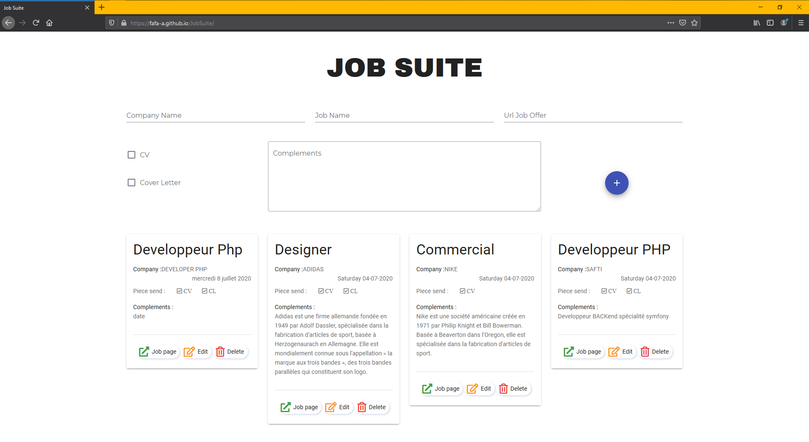

# job-suite

The goal of this side project is making a website for monitoring offers of job apply. In same way learning the framework vuejs. I stopped this project fews month ago. I remake it with the composition api and finish the project as soon as possible .

## Installation

Project is not **finished**.

1. git clone this repo
2. cd job-suite
3. npm install
4. npm run serve
